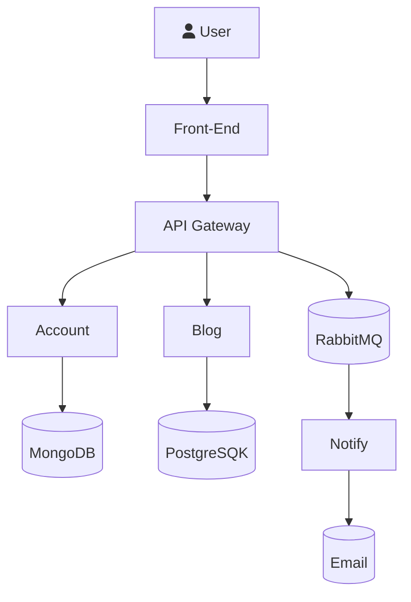
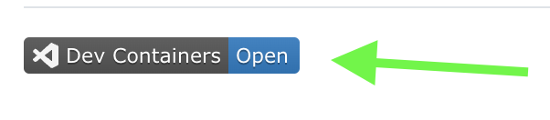

# Сервисы

# Как запустить в Dev Container (быстрый выриант)

☝️ Нажать на "DevContainers Open" ☝️

# Как запустить через `docker compose`
Более детально про другие варианты запуска приложений тут [How to Run Applications](./how-to/1-How-to-Run-Applications.md). Там описано
* Переменные окружения
* Как запускать `docker compose` файл
* Как запускать приложения

# Как соедениться с БД
Тут [How to Connect to Database](./how-to/2-How-to-Connect-to-Databases) можно узнать как соедениться с БДых после запуска приложений.
